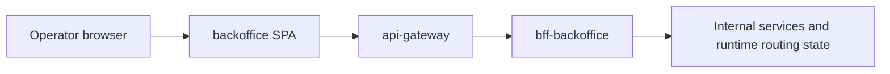

# backoffice

Last updated: 2026-05-03.

[](https://codecov.io/gh/AxiomNode/backoffice)

React-based operations console for the AxiomNode ecosystem.

## Responsibility

`backoffice` is the operator-facing interface for the platform. It is not just an admin dashboard; it is the visible surface for runtime inspection and AI-related operational diagnostics.

## Runtime role

### Runtime context



### Main responsibilities

- Provide visibility for health, traffic, and service-level metrics.
- Enable controlled operational actions for admin users.
- Offer a secure UI layer over edge APIs.

Detailed architecture and operational guidance now live under `docs/` so the root README stays a landing page rather than a second full manual.

## Runtime surface

### Operator-facing scope

`backoffice` is the main operator UI for observing and changing effective runtime behavior.

### Tech stack

- React
- TypeScript
- Vite
- Tailwind CSS

### Key modules

- observability dashboards and service overview panels
- operational controls and administration views
- AI diagnostics and runtime-target management
- role-gated operator access

### Primary operational use cases

- inspect service summary and operational health
- inspect AI diagnostics and RAG coverage
- change the active ai-engine destination used by staging runtime
- manage shared ai-engine presets for repeated operator use
- switch the llama server destination dynamically (workstation host/IP) for diagnostics and manual recovery flows

See `docs/architecture/README.md` for the runtime integration model and local source layout.

## Local setup

### Local development

```bash
npm install
cp .env.example .env
npm run dev
```

Build for production:

```bash
npm run build
```

### Edge integration (dev)

```bash
cd ../secrets
node scripts/prepare-runtime-secrets.mjs dev

cd ../platform-infra/environments/dev
docker compose -f docker-compose.edge-integration.yml up -d --build
```

## Deployment and operations notes

- CI validation and local verification commands are documented in `docs/operations/README.md`.
- Cross-repo operator behavior is documented in `../docs/guides/capabilities/operations/backoffice-operational-diagnostics.md`.
- Runtime routing and targeting semantics are documented in `../docs/guides/capabilities/operations/runtime-routing-control.md`.

## Dependencies and contracts

### Environment variables

- `VITE_API_BASE_URL`
- `VITE_EDGE_API_TOKEN`
- `VITE_AUTH_MODE` (`dev` or `firebase`)
- `VITE_FIREBASE_*`
- `VITE_ADMIN_DEV_UID`

## Documentation

- `docs/README.md`
- `docs/architecture/README.md`
- `docs/operations/README.md`
- `docs/guides/README.md`

## References

- `docs/architecture/`
- `docs/operations/`
- `../docs/guides/capabilities/operations/backoffice-operational-diagnostics.md`
- `../docs/operations/runtime-routing-and-service-targeting.md` (historical reference)
