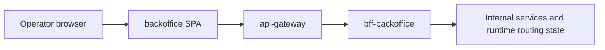

# backoffice

React-based operations console for the AxiomNode ecosystem.

## Architectural role

`backoffice` is the operator-facing interface for the platform. It is not just an admin dashboard; it is the visible surface for runtime inspection, service targeting, and AI-related operational diagnostics.

## Runtime context



## Responsibilities

- Provide visibility for health, traffic, and service-level metrics.
- Enable controlled operational actions for admin users.
- Offer a secure UI layer over edge APIs.

## Tech stack

- React
- TypeScript
- Vite
- Tailwind CSS

## Key modules

1. Observability dashboards.
2. Control/administration views.
3. AI generation control actions.
4. Role-gated access (`SuperAdmin`, `Admin`, `Viewer`, `Gamer`).
5. Runtime destination management for operational service targeting.

## Primary operational use cases

- inspect service summary and operational health
- inspect AI diagnostics and RAG coverage
- change the active ai-engine destination used by staging runtime
- manage shared ai-engine presets for repeated operator use
- inspect and retarget service upstreams through the backoffice BFF

## Local development

```bash
npm install
cp .env.example .env
npm run dev
```

Build for production:

```bash
npm run build
```

## Edge integration (dev)

```bash
cd ../secrets
node scripts/prepare-runtime-secrets.mjs dev

cd ../platform-infra/environments/dev
docker compose -f docker-compose.edge-integration.yml up -d --build
```

## CI/CD workflow behavior

- `.github/workflows/ci.yml`
	- Trigger: push (`main`, `develop`), pull request, manual dispatch.
	- Job `validate`: installs dependencies, blocks tracked build artifacts, runs tests, typechecks, builds the app, and audits production dependencies.
	- Job `trigger-platform-infra-build`:
		- Runs on push to `main`.
		- Waits for `validate` to succeed before dispatching `platform-infra`.
		- Dispatches `platform-infra/.github/workflows/build-push.yaml` with `service=backoffice`.
		- Requires `PLATFORM_INFRA_DISPATCH_TOKEN` in this repo.

## Deployment automation chain

Push to `main` triggers image rebuild in `platform-infra`. For the covered runtime chain, successful validation and packaging lead to automatic rollout to `stg`.

## Runtime integration notes

- The overview panel exposes shared ai-engine destination presets backed by `bff-backoffice` persistence.
- Diagnostics panels can reflect effective runtime state, not only static environment configuration.
- The browser may also hold a local edge endpoint override for controlled troubleshooting of alternative BFF or gateway endpoints.

## Maintainability notes

- Keep operator-facing controls explicit and reversible.
- Prefer shared backend persistence for team-wide runtime options.
- Use UI copy that distinguishes environment defaults from runtime overrides.

## Environment variables

- `VITE_API_BASE_URL`
- `VITE_EDGE_API_TOKEN`
- `VITE_AUTH_MODE` (`dev` or `firebase`)
- `VITE_FIREBASE_*`
- `VITE_ADMIN_DEV_UID`

## Related documents

- `docs/architecture/`
- `docs/operations/`
- `../docs/operations/runtime-routing-and-service-targeting.md`
